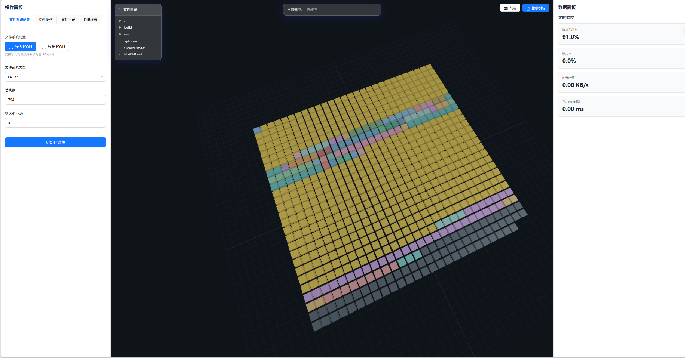

<center>

# Fcon:文件系统可视化项目

[English](./README_EN.md) | [中文](./README.md)

[](./LICENSE)
[](https://fcon-viewer.netlify.app/)
[](https://vuejs.org/)
[](https://threejs.org/)
[](https://nodejs.org/)
[](https://isocpp.org/)
[](https://cmake.org/)

</center>

一个基于Vue3 + Three.js的交互式文件系统可视化教学工具，通过3D可视化展示文件系统的核心原理和操作过程。

## 🌐 在线演示

<div align="center">

**[🚀 立即体验在线版本](https://fcon-viewer.netlify.app/)**

无需安装，直接在浏览器中体验完整的文件系统可视化功能！

</div>

## 📸 项目演示

<div align="center">



*文件系统可视化界面演示*

</div>

## ✨ 特性

- 🎨 **3D可视化**: 使用Three.js实现磁盘块和目录树的3D可视化
- 📊 **性能监控**: 实时监控磁盘利用率、碎片率、IO吞吐量等指标
- 🔧 **文件操作**: 支持文件创建、删除、目录管理等操作
- 📈 **数据图表**: 多种图表类型展示性能数据
- 💻 **终端模拟**: 提供类Unix终端界面，支持常用文件系统命令
- 📚 **教学引导**: 完整的操作引导和原理说明

## 🚀 快速开始

> 💡 **提示**: 想要快速体验？直接访问 [在线演示](https://fcon-viewer.netlify.app/) 无需安装即可使用！

### 本地开发

#### 安装依赖

```bash
npm install
```

#### 启动开发服务器

```bash
npm run dev
```

#### 构建生产版本

```bash
npm run build
```

## 📖 文档

详细文档请查看 [docs](./docs/) 目录：

- [安装指南](./docs/installation.md) - 详细的安装和配置说明
- [功能特性](./docs/features.md) - 完整的功能列表和说明
- [架构设计](./docs/architecture.md) - 系统架构和模块设计
- [使用指南](./docs/usage.md) - 详细的使用说明和示例
- [开发指南](./docs/development.md) - 开发环境设置和代码规范

## 🛠️ 技术栈

- **前端框架**: Vue 3 (Composition API)
- **状态管理**: Pinia
- **3D渲染**: Three.js
- **数据图表**: ECharts
- **UI组件**: Ant Design Vue
- **动画**: GSAP
- **构建工具**: Vite
- **样式**: Tailwind CSS

## 📁 项目结构

```
file_system_view/
├── src/              # 源代码
├── cli/              # C++命令行工具
├── docs/             # 文档
├── example/           # 示例文件
└── package.json
```

## 🎯 核心功能

### 文件系统操作
- 文件创建/删除
- 目录创建/导航
- 三种分配算法（连续/链接/索引）
- 碎片整理

### 可视化展示
- 3D磁盘块网格
- 3D目录树结构
- 实时状态更新
- 交互式选择

### 性能监控
- 实时指标监控
- 多种图表展示
- 数据导出功能

> 💡 **提示**: 更多详细功能说明请查看 [功能特性文档](./docs/features.md)

## 📝 命令行工具 (fcon)

项目包含一个C++命令行工具 `fcon`，用于扫描Linux文件系统并生成JSON配置文件，方便快速导入文件系统数据。

### 快速使用

```bash
# 编译
cd cli && mkdir build && cd build && cmake .. && make

# 扫描目录
./bin/fcon /home/user/documents

# 指定参数
./bin/fcon /path/to/dir -o output.json -b 4 -t FAT32
```

> 📖 **详细文档**: 完整的命令行工具使用说明、功能特性、参数选项和输出格式，请查看 [cli/README.md](./cli/README.md)

## 🤝 贡献

欢迎提交Issue和Pull Request！

## 📄 许可证

MIT License

## 🔗 相关链接

- [🌐 在线演示](https://fcon-viewer.netlify.app/) - 直接在浏览器中体验
- [Vue 3 文档](https://vuejs.org/)
- [Three.js 文档](https://threejs.org/)
- [Ant Design Vue](https://antdv.com/)
